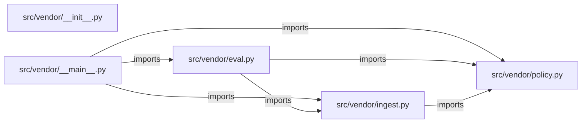

# fde-vendor-review — project architecture

[README](README.md) · [Interview questions and answers](INTERVIEW_QA.md)

## Purpose and scope

Simulated forward deployed engagement for Northline Procurement. New vendor packets were sitting in a shared inbox. Analysts were one missed insurance date away from paying a vendor, and a bank-detail change had been accepted by the same person who entered it. Legal will not let software mark a packet approved.

This document describes files and symbols in this checkout. Deployment templates and statements in the original overview are distinguished from a verified running environment.

## Component diagram



For Python repositories, arrows show resolved local imports, not network calls or deployment order. Otherwise the diagram is a repository component map; containment arrows do not assert runtime integration.

## Components and responsibilities

| Component | Responsibility |
| --- | --- |
| [`src/vendor/policy.py`](src/vendor/policy.py) | Functions: `review_packet`, `render` |
| [`src/vendor/eval.py`](src/vendor/eval.py) | Functions: `run` |
| [`src/vendor/ingest.py`](src/vendor/ingest.py) | Functions: `load_packets`, `load_cases` |
| [`requirements.txt`](requirements.txt) | Implementation or supporting configuration |
| [`src/vendor/__init__.py`](src/vendor/__init__.py) | Implementation or supporting configuration |
| [`src/vendor/__main__.py`](src/vendor/__main__.py) | Functions: `main` |
| [`Dockerfile`](Dockerfile) | Container build/service configuration |
| [`tests/test_policy.py`](tests/test_policy.py) | Executable checks and regression examples |
| [`.github/workflows/ci.yml`](.github/workflows/ci.yml) | GitHub Actions job definitions |
| [`README.md`](README.md) | Project explanations or operating notes |
| [`docs/01-discovery.md`](docs/01-discovery.md) | Project explanations or operating notes |
| [`docs/02-security.md`](docs/02-security.md) | Project explanations or operating notes |

## Existing design and operating guides

These checked-in guides provide the project’s detailed design, operational context, or deployment view:

- [`docs/01-discovery.md`](docs/01-discovery.md).
- [`docs/02-security.md`](docs/02-security.md).

## Implementation walkthrough

### `review_packet(packet: Packet, as_of: date=AS_OF)`

Source: [`src/vendor/policy.py`](src/vendor/policy.py#L36).

Calls visible in this function: `'; '.join`, `Review`, `date.fromisoformat`, `incomplete.append`, `packet.bank_change.strip`, `packet.bank_change.strip().lower`, `packet.sanctions_flag.strip`, `packet.sanctions_flag.strip().lower`, `packet.w9.strip`, `packet.w9.strip().lower`.

```python
def review_packet(packet: Packet, as_of: date = AS_OF) -> Review:
    if packet.sanctions_flag.strip().lower() == "yes":
        return Review(packet.vendor_id, "blocked_sanctions", "Sanctions flag is yes. No override in this tool.")
    incomplete = []
    if packet.w9.strip().lower() != "yes":
        incomplete.append("W-9 is missing")
    try:
        expiry = date.fromisoformat(packet.insurance_expiry)
    except ValueError:
        expiry = None
    if expiry is None or expiry < as_of:
        incomplete.append("insurance is expired or missing")
    if incomplete:
        return Review(packet.vendor_id, "blocked_incomplete", "; ".join(incomplete) + ".")
    if packet.bank_change.strip().lower() == "yes":
        return Review(
            packet.vendor_id,
            "manual_review",
            "Bank details changed. A second person reviews this before any payment setup.",
        )
    return Review(packet.vendor_id, "ready_for_human", "Packet is complete. It still waits for a person.")
```

### `run(path: Path | None=None)`

Source: [`src/vendor/eval.py`](src/vendor/eval.py#L9).

Calls visible in this function: `failures.append`, `len`, `load_cases`, `load_packets`, `print`, `review.render`, `review.render().lower`, `review_packet`.

```python
def run(path: Path | None = None) -> int:
    packets = load_packets()
    failures = []
    cases = load_cases(path)
    for case in cases:
        review = review_packet(packets[case["vendor_id"]])
        if review.decision != case["expected_decision"]:
            failures.append(f"{case['vendor_id']}: {review.decision}")
        if "approved" in review.render().lower():
            failures.append(f"{case['vendor_id']}: said approved")
    if failures:
        print(f"{len(failures)} eval failure(s)")
        for failure in failures:
            print(f"- {failure}")
        return 1
    print(f"{len(cases)} eval cases passed")
    return 0
```

### `load_packets()`

Source: [`src/vendor/ingest.py`](src/vendor/ingest.py#L14).

Calls visible in this function: `(DATA_DIR / 'packets.csv').open`, `Packet`, `csv.DictReader`.

```python
def load_packets() -> dict[str, Packet]:
    packets = {}
    with (DATA_DIR / "packets.csv").open(newline="") as handle:
        for row in csv.DictReader(handle):
            packet = Packet(
                vendor_id=row["vendor_id"],
                w9=row["w9"],
                insurance_expiry=row["insurance_expiry"],
                bank_change=row["bank_change"],
                sanctions_flag=row["sanctions_flag"],
            )
            packets[packet.vendor_id] = packet
    return packets
```

### `render(self)`

Source: [`src/vendor/policy.py`](src/vendor/policy.py#L25).

Calls visible in this function: `RuntimeError`, `text.lower`.

```python
    def render(self) -> str:
        text = (
            f"Vendor {self.vendor_id}: {self.decision}.\n"
            f"{self.reason}\n"
            "A person still has to accept this packet. The tool does not approve it.\n"
        )
        if "approved" in text.lower():
            raise RuntimeError("vendor review must not say approved")
        return text
```

## Validation and failure paths

| Explicit exception | Source |
| --- | --- |
| `SystemExit(main())` | [`src/vendor/__main__.py`](src/vendor/__main__.py#L23) |
| `RuntimeError('vendor review must not say approved')` | [`src/vendor/policy.py`](src/vendor/policy.py#L32) |

These are explicit exceptions in the inspected source, rather than a claim that every failure is handled. Follow the calling handler to see whether the exception becomes an HTTP response or propagates.

## Data flow and design decisions

### What is the input-to-output contract of `review_packet`

In [`src/vendor/policy.py`](src/vendor/policy.py#L36), `review_packet(packet: Packet, as_of: date=AS_OF)` receives the inputs. The function computes these intermediate values:

- `incomplete = []`

Its result is defined by:

- `Review(packet.vendor_id, 'ready_for_human', 'Packet is complete. It still waits for a person.')`
- `Review(packet.vendor_id, 'blocked_sanctions', 'Sanctions flag is yes. No override in this tool.')`
- `Review(packet.vendor_id, 'blocked_incomplete', '; '.join(incomplete) + '.')`

### Which decision rules or boundary conditions should an interviewer challenge

The implementation in [`src/vendor/policy.py`](src/vendor/policy.py#L36) branches on:

- `packet.sanctions_flag.strip().lower() == 'yes'`
- `packet.w9.strip().lower() != 'yes'`
- `expiry is None or expiry < as_of`
- `incomplete`
- `packet.bank_change.strip().lower() == 'yes'`

A useful extension is a table-driven test that covers each condition just below, at, and above its boundary where applicable. These expressions are the current rules; changing them changes behavior and should be justified by the project’s acceptance criteria.

## Setup and verification

The following commands are derived from the checked-in dependency/test contracts. Execute them from the repository root; the block prepares a local environment, not a cloud deployment.

```bash
python3 -m venv .venv
source .venv/bin/activate
python -m pip install -r requirements.txt
python -m pytest -q
```

Python dependencies: [`requirements.txt`](requirements.txt).

Test entry points: [`tests/test_policy.py`](tests/test_policy.py).

Automation definitions: [`.github/workflows/ci.yml`](.github/workflows/ci.yml). Read their triggers and job steps to determine what CI actually runs.

## Operating boundaries and design review

Before turning this checkout into a customer deployment, establish the input contract, data ownership, access controls, failure response, evaluation criteria, and rollback owner. Repository fixtures and unit tests demonstrate local behavior; they do not establish throughput, uptime, compliance, or business impact.

A useful architecture review starts with the linked implementation: identify where input enters, where a decision is made, which state can change, and which external dependency can fail. Add a deployment view only for infrastructure that is actually configured and exercised.
